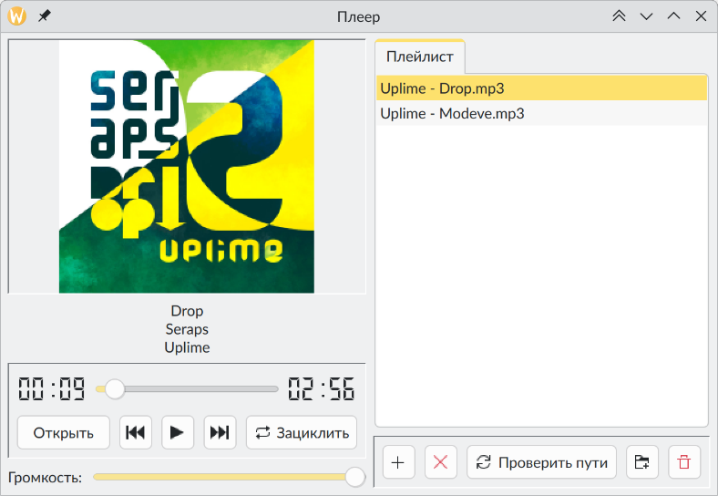

# Music player (Qt/QMultimedia)

Практическая работа с первого курса обучения в университете. Реализует базовый плеер с поддержкой плейлистов, перемоткой, зацикливанием композиций. Не все функции были реализованы до конца и отлажены, но основную задачу программа выполняет.

Practical work from the first year of the university. Implements a basic player with playlist, rewind, repeat support. Not every feature of the software was fully implemented or tested, but it gets the main job done.

## Build Requirements / Требования для сборки

- Linux (TagLib is included by gcc flag/TagLib подключен через флаг gcc)
- Qt5/6 (`qtbase5-dev`/`qt6-base-dev`)
- QMultimedia (`qtmultimedia5-dev`/`qt6-multimedia-dev`, `libqt5multimedia5-plugins`)
- CMake 3.5+ (`cmake`)
- TagLib (`libtag-dev`)

The package names mentioned below are valid for Debian-based distros.

Названия выше упомянутых пакетов справедливы для дистрибутивов на основе Debian.
